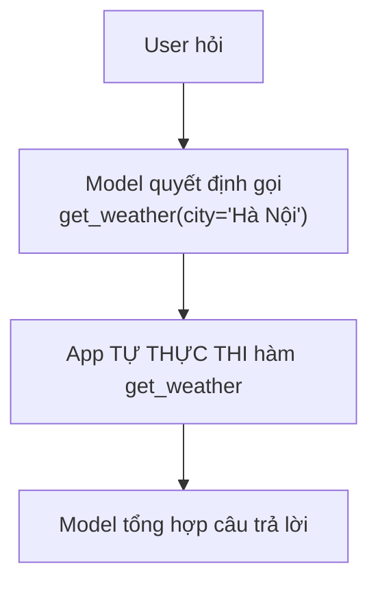
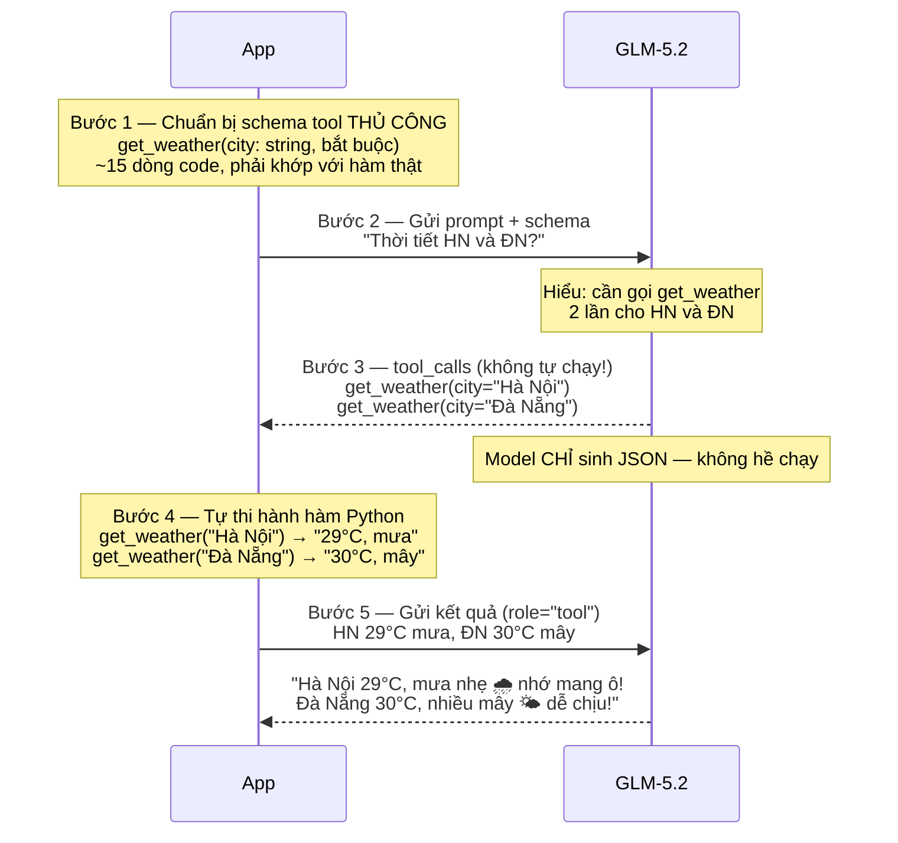
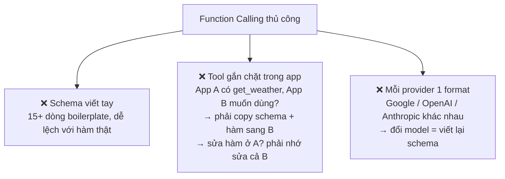

# 01 — Function Calling thuần (GLM-5.2 qua NVIDIA API, OpenAI-compatible)

Tool `get_weather` được **định nghĩa schema thủ công** và **thực thi ngay trong app**.
Model chỉ quyết định gọi tool nào — app mới là nơi chạy.



## Cách chạy

```bash
pip install -r ../requirements.txt
cp .env.example .env

python weather_function_calling.py   # có tool
python weather_no_tool.py            # không có tool — để so sánh
```

## File

| File | Mô tả |
|---|---|
| `weather_function_calling.py` | Định nghĩa schema, thực thi tool, gọi GLM-5.2, xử lý vòng lặp function calling |
| `weather_no_tool.py` | Cùng câu hỏi nhưng KHÔNG truyền tool nào — model tự bịa/từ chối trả lời |
| `prompts.py` | System prompt dùng chung cho cả 2 file trên |

---

## Function Calling là gì? Giải thích đơn giản

Hình dung bạn có một **trợ lý ảo** rất giỏi ngôn ngữ, nhưng **không biết gì về thế giới thật** — không biết thời tiết, không truy cập được database, không gọi được API.

Function Calling là cách bạn **dạy trợ lý ảo sử dụng công cụ**:

```mermaid
flowchart LR
    subgraph NoFC["Không có Function Calling"]
        direction TB
        A1["User: 'Thời tiết HN?'"] --> A2["Model"]
        A2 --> A3["'Tôi không biết'<br/>(bó tay vì không có dữ liệu)"]
    end

    subgraph FC["Có Function Calling"]
        direction TB
        B1["User: 'Thời tiết HN?'"] --> B2["Model<br/>(biết có tool get_weather)"]
        B2 --> B3["'Hãy gọi get_weather(\"HN\")'"]
        B3 --> B4["App chạy hàm"]
        B4 --> B5["Model: 'HN: 29°C, mưa'"]
    end
```

**Điểm mấu chốt:** Model **KHÔNG chạy** hàm. Nó chỉ nói *"hãy gọi hàm X với tham số Y"*.

---

## Minh hoạ từng bước chi tiết

User hỏi: **"Thời tiết Hà Nội và Đà Nẵng hôm nay thế nào?"**



---

## Nhìn vào code thật

3 phần quan trọng trong `weather_function_calling.py`:

**Phần 1 — Schema viết tay** (model cần biết tool trông như thế nào — định dạng JSON Schema chuẩn OpenAI-compatible):

```python
# App phải TỰ MÔ TẢ tool cho model — viết tay, dễ sai
GET_WEATHER_TOOL = {
    "type": "function",
    "function": {
        "name": "get_weather",
        "description": "Lấy thời tiết hiện tại của một thành phố",
        "parameters": {
            "type": "object",
            "properties": {
                "city": {"type": "string", "description": "Tên thành phố"},
            },
            "required": ["city"],
        },
    },
}
```

**Phần 2 — Hàm thực thi** (app tự chạy khi model yêu cầu):

```python
# App phải CÓ hàm thật để chạy — model không chạy hàm này
def get_weather(city: str) -> str:
    return json.dumps({"city": city, "nhiệt_độ": "29°C", ...})
```

**Phần 3 — Vòng lặp** (nhận yêu cầu → chạy → trả lại):

```python
while message.tool_calls:
    for tool_call in message.tool_calls:
        args = json.loads(tool_call.function.arguments)
        result = get_weather(**args)   # ← APP chạy, không phải model
    # gửi result lại cho model (role="tool") để tổng hợp câu trả lời
```

---

## Luồng hoạt động

1. App định nghĩa tool bằng JSON Schema viết tay (tên, tham số, kiểu)
2. App gửi prompt + danh sách tool tới GLM-5.2 (qua NVIDIA API)
3. Model trả về `tool_calls` — yêu cầu gọi `get_weather`
4. App **tự chạy** hàm `get_weather()` và đưa kết quả trả lại model (role `"tool"`)
5. Model tổng hợp câu trả lời cuối cho user

## Nhược điểm



**MCP giải quyết tất cả các vấn đề trên** → xem [02-mcp-basics/](../02-mcp-basics/)

Bước tiếp theo: [02-mcp-basics/](../02-mcp-basics/) — tách tool ra MCP server độc lập.
