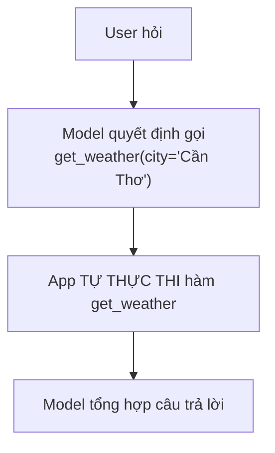
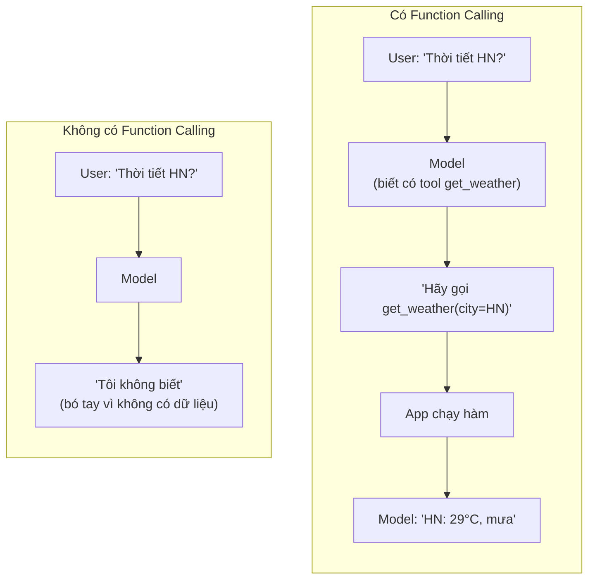
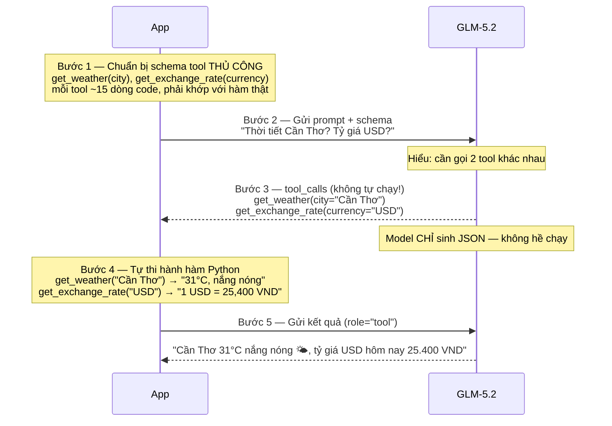

# 01 — Function Calling thuần (GLM-5.2 qua NVIDIA API, OpenAI-compatible)

Tool `get_weather` + `get_exchange_rate` được **định nghĩa schema thủ công** và
**thực thi ngay trong app**. Model chỉ quyết định gọi tool nào — app mới là nơi chạy.



## Cách chạy

```bash
pip install -r ../requirements.txt
cp ../.env.example ../.env   # điền NVIDIA_API_KEY ở gốc repo (dùng chung với 02/03)

python weather_function_calling.py   # có tool
python weather_no_tool.py            # không có tool — để so sánh
```

## File

| File | Mô tả |
|---|---|
| `weather_function_calling.py` | Định nghĩa schema, thực thi tool, gọi GLM-5.2, xử lý vòng lặp function calling |
| `weather_no_tool.py` | Cùng câu hỏi nhưng KHÔNG truyền tool nào — model tự bịa/từ chối trả lời |
| `prompts.py` | System prompt dùng chung cho cả 2 file trên |

---

## Function Calling là gì? Giải thích đơn giản

Hình dung bạn có một **trợ lý ảo** rất giỏi ngôn ngữ, nhưng **không biết gì về thế giới thật** — không biết thời tiết, không truy cập được database, không gọi được API.

Function Calling là cách bạn **dạy trợ lý ảo sử dụng công cụ**:



**Điểm mấu chốt:** Model **KHÔNG chạy** hàm. Nó chỉ nói *"hãy gọi hàm X với tham số Y"*.

---

## Minh hoạ từng bước chi tiết

User hỏi: **"Thời tiết Cần Thơ hôm nay thế nào? Và tỷ giá USD hôm nay bao nhiêu?"**



---

## Nhìn vào code thật

3 phần quan trọng trong `weather_function_calling.py`:

**Phần 1 — Schema viết tay** (model cần biết tool trông như thế nào — định dạng JSON Schema chuẩn OpenAI-compatible):

```python
# App phải TỰ MÔ TẢ tool cho model — viết tay, dễ sai
TOOLS = [
    {
        "type": "function",
        "function": {
            "name": "get_weather",
            "description": "Lấy thời tiết hiện tại của một thành phố",
            "parameters": {
                "type": "object",
                "properties": {"city": {"type": "string", "description": "Tên thành phố"}},
                "required": ["city"],
            },
        },
    },
    # ... get_exchange_rate tương tự
]
```

**Phần 2 — Hàm thực thi** (app tự chạy khi model yêu cầu, dùng chung `shared/mock_data.py`):

```python
# App phải CÓ hàm thật để chạy — model không chạy hàm này
from shared.mock_data import get_weather, get_exchange_rate
TOOL_IMPLS = {"get_weather": get_weather, "get_exchange_rate": get_exchange_rate}
```

**Phần 3 — Vòng lặp** (nhận yêu cầu → chạy → trả lại):

```python
while message.tool_calls:
    for tool_call in message.tool_calls:
        args = json.loads(tool_call.function.arguments)
        fn = TOOL_IMPLS[tool_call.function.name]
        result = fn(**args)   # ← APP chạy, không phải model
    # gửi result lại cho model (role="tool") để tổng hợp câu trả lời
```

---

## Luồng hoạt động

1. App định nghĩa tool bằng JSON Schema viết tay (tên, tham số, kiểu)
2. App gửi prompt + danh sách tool tới GLM-5.2 (qua NVIDIA API)
3. Model trả về `tool_calls` — yêu cầu gọi tool phù hợp
4. App **tự chạy** hàm tương ứng và đưa kết quả trả lại model (role `"tool"`)
5. Model tổng hợp câu trả lời cuối cho user

---

Bước tiếp theo: [`../README.md`](../README.md) — so sánh Function Calling với MCP (02) và CLI (03).
