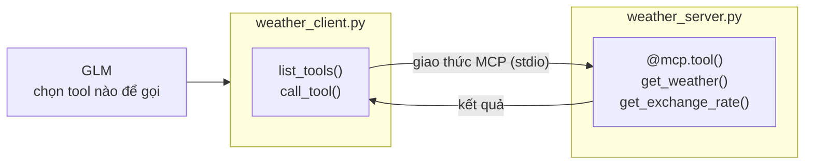
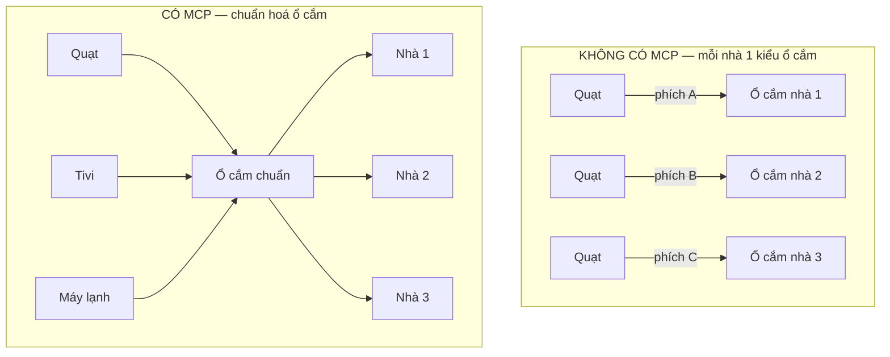
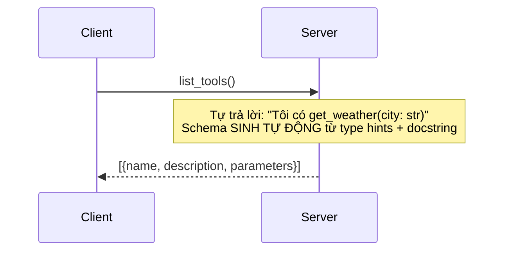
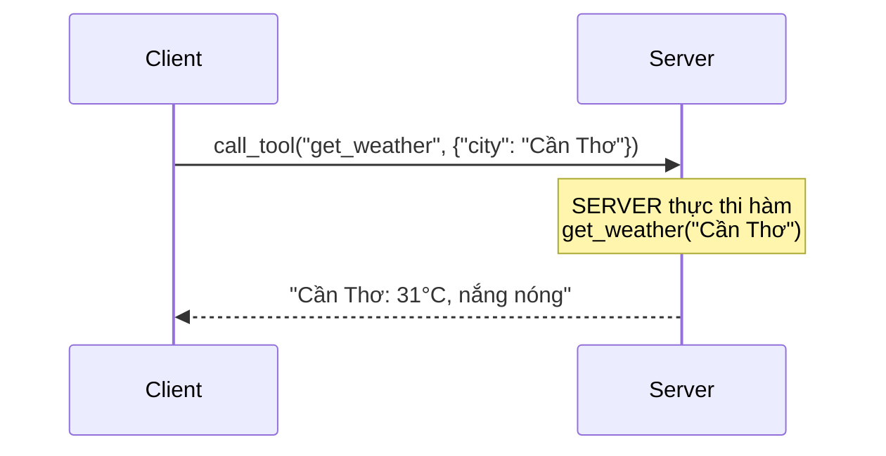
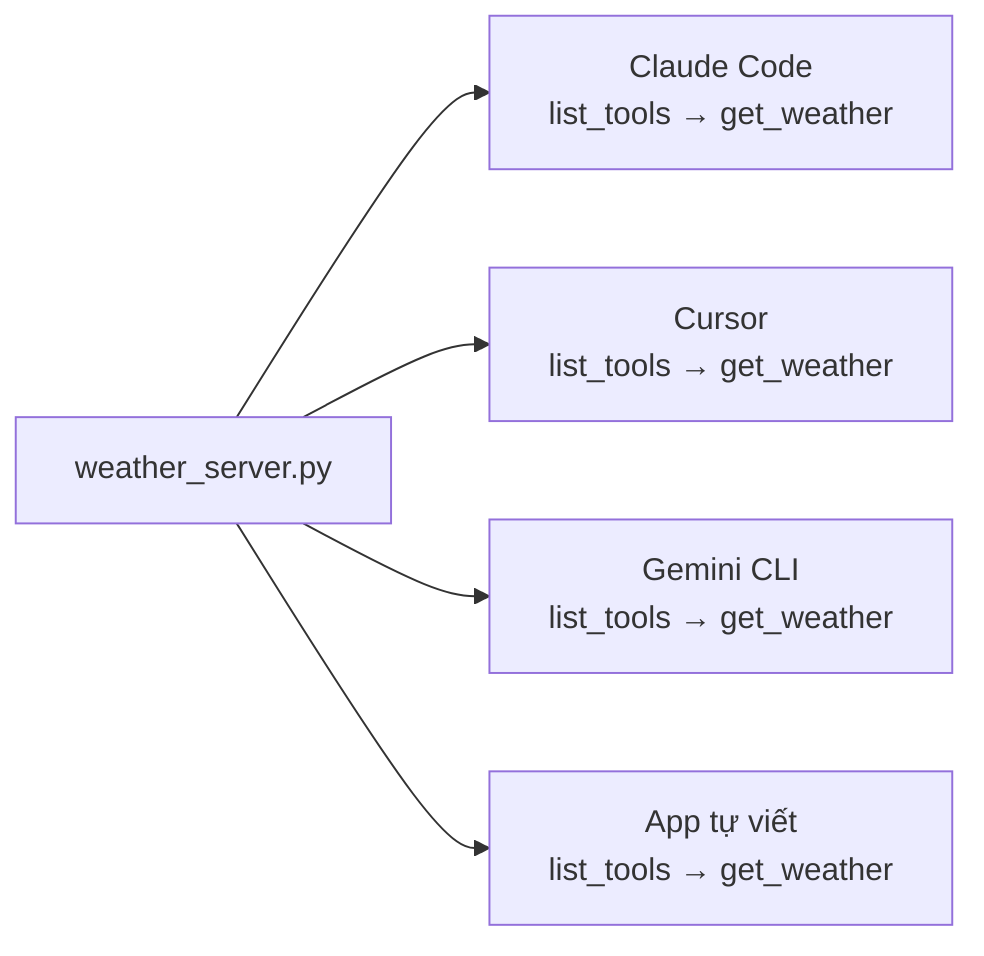

# 02 — MCP Basics (Server + Client)

Tool `get_weather` + `get_exchange_rate` được tách ra một **MCP server độc lập**.
Server tự công bố tool qua giao thức MCP; bất kỳ client nào (Claude Code, Cursor, hoặc
`weather_client.py`) cũng cắm vào dùng được — không cần biết code bên trong.

`weather_client.py` gắn thêm GLM — model THẬT sự quyết định gọi tool nào dựa trên
schema mà `list_tools()` tự khám phá được, MCP server thực thi.



## Cách chạy (cần NVIDIA API key — dùng chung `.env` ở gốc repo)

```bash
pip install -r ../requirements.txt
cp ../.env.example ../.env   # điền NVIDIA_API_KEY (dùng chung với 01/03)
python weather_client.py     # client tự khởi động weather_server.py
```

Kết quả mong đợi (rút gọn):

```
Tools MCP server cung cấp:
  - get_weather: Lấy thời tiết hiện tại của một thành phố.
  - get_exchange_rate: Lấy tỷ giá quy đổi sang VND của một loại ngoại tệ hôm nay.
  - get_name: Lấy tên của tool

User: Thời tiết Cần Thơ hôm nay thế nào? Và tỷ giá USD hôm nay bao nhiêu?

  [model yêu cầu] get_weather({'city': 'Cần Thơ'})
  [MCP server]   -> Cần Thơ: 31°C, nắng nóng
  [model yêu cầu] get_exchange_rate({'currency': 'USD'})
  [MCP server]   -> 1 USD = 25,400 VND

Trả lời: Cần Thơ hôm nay 31°C, nắng nóng — nhớ mang nước, đội mũ nhé! 🌤️
Tỷ giá USD hôm nay: 1 USD = 25.400 VND.
```

## Files

| File | Mô tả |
|---|---|
| `weather_server.py` | MCP server — `@mcp.tool()` tự sinh schema từ type hints + docstring, dùng chung `shared/mock_data.py` |
| `weather_client.py` | MCP client + GLM — `list_tools()` → đưa cho model chọn tool → `call_tool()` thực thi qua MCP |

---

## MCP là gì? Giải thích đơn giản

### Phép so sánh: ổ cắm điện chuẩn



> Không có MCP: mỗi nhà 1 kiểu ổ → mua thiết bị phải xem nhà dùng ổ gì.
> Có MCP: viết tool 1 lần → mọi AI app dùng được; viết client 1 lần → mọi tool server cắm vào được.

### 3 bước MCP hoạt động

**Bước 1 — KHÁM PHÁ: "Anh có tool gì?"**



**Bước 2 — GỌI TOOL: "Cho tôi thời tiết Cần Thơ"**



**Bước 3 — TÁI SỬ DỤNG: viết 1 lần, dùng mọi nơi**



> 1 server phục vụ N client — không sửa dòng code nào.

---

## Đăng ký server với AI client

**Claude Code** (làm 1 lần, dùng mãi):

```bash
claude mcp add weather -- python /đường/dẫn/tới/weather_server.py
```

**Gemini CLI**:

```bash
# Thêm vào ~/.gemini/settings.json
"mcpServers": {
  "weather": {
    "command": "python",
    "args": ["/đường/dẫn/tới/weather_server.py"]
  }
}
```

---

Bước tiếp theo: [`../README.md`](../README.md) — so sánh MCP với Function Calling (01) và CLI (03).
