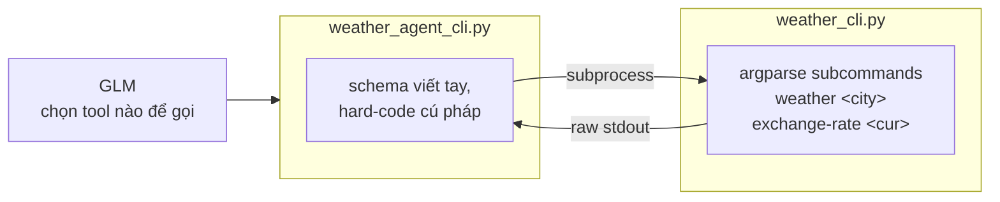

# 03 — CLI

Tool `get_weather` + `get_exchange_rate` được công bố qua **CLI thuần** (argparse)
thay vì qua MCP.

`weather_agent_cli.py` gắn thêm GLM (schema viết tay) — model quyết định gọi
tool nào, agent thực thi bằng cách spawn `subprocess` gọi `weather_cli.py`.



## Cách chạy (cần NVIDIA API key — dùng chung `.env` ở gốc repo)

```bash
pip install -r ../requirements.txt
cp ../.env.example ../.env   # điền NVIDIA_API_KEY (dùng chung với 01/02)

# Gọi CLI trực tiếp (không cần API key)
python weather_cli.py weather Hanoi
python weather_cli.py exchange-rate USD
python weather_cli.py --help

# Agent + model chọn tool, agent gọi CLI qua subprocess
python weather_agent_cli.py
```

## Files

| File | Mô tả |
|---|---|
| `weather_cli.py` | CLI thuần — `argparse` với subcommand `weather`/`exchange-rate`, dùng chung `shared/mock_data.py` |
| `weather_agent_cli.py` | Agent + GLM — model chọn tool (schema viết tay), thực thi bằng `subprocess` gọi CLI |

---

Bước tiếp theo: [`../README.md`](../README.md) — so sánh CLI với Function Calling (01) và MCP (02).
