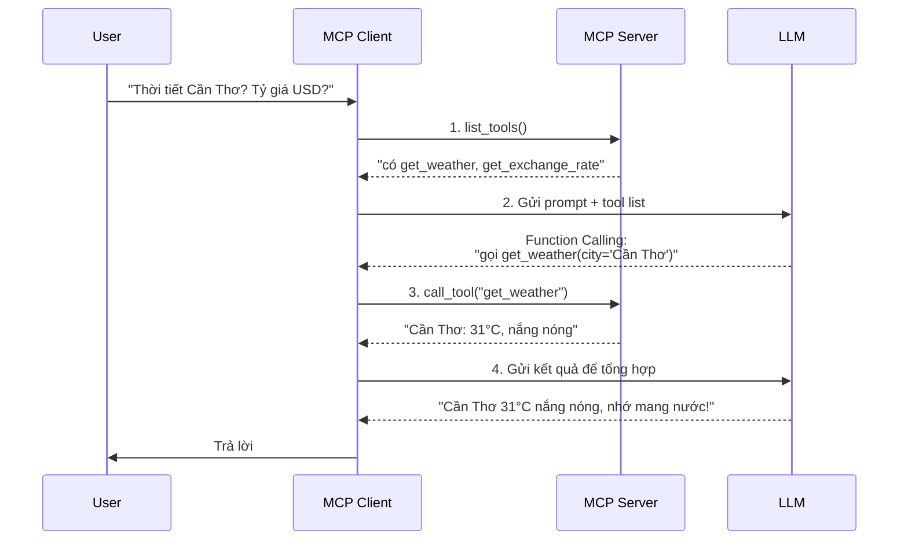
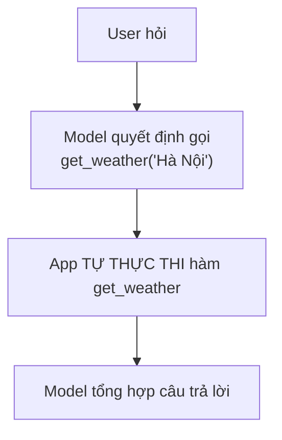
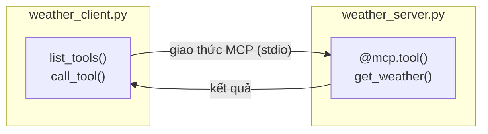
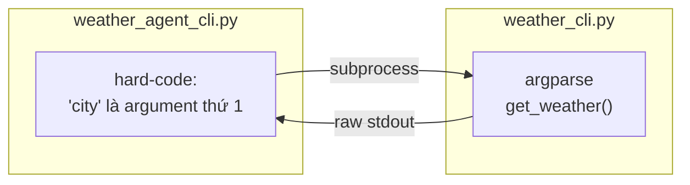
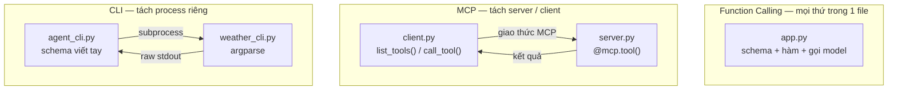

# Phân biệt Function Calling, MCP và CLI

Đây là ba cách khác nhau để model gọi được công cụ bên ngoài, hay bị nhầm lẫn nhưng thực ra ở **các tầng khác nhau**, và **bổ sung cho nhau** chứ không thay thế.

## Cấu trúc repo

```
day26-mcp/
├── README.md                ← Bạn đang đọc file này
├── requirements.txt         ← pip install -r requirements.txt
├── .env.example             ← Dùng CHUNG cho cả 01/02/03 (1 lần duy nhất)
│
├── shared/
│   └── mock_data.py         ← Mock data CHUNG: get_weather, get_exchange_rate
│
├── 01-function-calling/     ← Bước 1: Function Calling thuần (GLM, schema viết tay)
│   ├── README.md
│   └── weather_function_calling.py
│
├── 02-mcp-basics/           ← Bước 2: MCP server + client + GLM
│   ├── README.md
│   ├── weather_server.py
│   └── weather_client.py
│
└── 03-cli/                  ← Bước 3: CLI thuần + GLM, so sánh với MCP
    ├── README.md
    ├── weather_cli.py
    └── weather_agent_cli.py
```

Cả 3 module dùng chung 1 bộ mock data (`shared/mock_data.py`: thời tiết + tỷ giá
ngoại tệ) và chung 1 `.env` ở gốc repo — chỉ khác nhau ở **cách công bố/gọi
tool**, còn model quyết định gọi tool nào (Function Calling) là như nhau ở cả 3.

## Quick start

```bash
python -m venv .venv && source .venv/bin/activate
pip install -r requirements.txt

cp .env.example .env   # điền NVIDIA_API_KEY — dùng chung cho cả 01/02/03

# Cách 1 — Function Calling thuần
cd 01-function-calling && python weather_function_calling.py

# Cách 2 — MCP (server tự công bố tool, GLM chọn tool qua Function Calling)
cd 02-mcp-basics && python weather_client.py

# Cách 3 — CLI thuần (agent gọi CLI qua subprocess, GLM chọn tool)
cd 03-cli && python weather_agent_cli.py
```

---

## Định nghĩa ngắn gọn

**Function Calling** là một *khả năng của model* (capability). Model được huấn luyện để khi bạn đưa cho nó danh sách các "công cụ" (kèm schema mô tả tham số), nó có thể tự quyết định gọi công cụ nào và sinh ra JSON tham số phù hợp. Bản thân model **không chạy** function — nó chỉ nói "hãy gọi `get_weather(city='Hanoi')`". App mới là nơi chạy tool.

**MCP (Model Context Protocol)** là một *giao thức chuẩn* (protocol) — giống như USB-C hay HTTP cho thế giới AI. Nó định nghĩa cách một **MCP Client** (như Claude Code, Claude Desktop) kết nối tới các **MCP Server** để khám phá và sử dụng tools, resources, prompts một cách thống nhất.

**CLI (Command Line Interface)** không phải là khái niệm riêng của AI — đó là cách công bố tool **lâu đời nhất**, tồn tại độc lập với model. Muốn cho model dùng CLI, agent phải tự spawn `subprocess` và tự biết trước cú pháp tham số; không có giao thức hay chuẩn khám phá nào cả.

---

## So sánh trực tiếp

| Tiêu chí | Function Calling | MCP | CLI thuần |
|---|---|---|---|
| **Bản chất** | Tính năng của mô hình (Model capability) | Giao thức giao tiếp client–server | Giao diện dòng lệnh — không phải khái niệm AI |
| **Ai định nghĩa tool?** | Bạn hard-code trong từng app | Server tự công bố (self-describe) tool | Không ai — chỉ có usage text từ `--help` |
| **Tái sử dụng** | Phải viết lại cho mỗi app/model | Viết 1 lần, mọi MCP client dùng được | Viết lại phần gọi `subprocess` cho mỗi agent |
| **Thực thi** | App của bạn tự chạy | MCP Server chạy, client điều phối | Process CLI chạy qua `subprocess` |
| **Tính chuẩn hóa** | Mỗi nhà cung cấp 1 kiểu (OpenAI, Anthropic khác nhau) | Một chuẩn chung do Anthropic đề xuất | Không có chuẩn — mỗi CLI tự quy định tham số riêng |
| **Hệ sinh thái** | Khó chia sẻ dạng module đóng gói sẵn | Dễ dàng chia sẻ và tải về các "MCP Servers" mã nguồn mở | Tận dụng được CLI có sẵn (`git`, `curl`, `docker`...) nhưng agent phải tự tích hợp từng cái |

## Quan hệ giữa chúng

Điểm quan trọng nhất: **MCP dùng Function Calling bên dưới**. Chúng không loại trừ nhau.
`02-mcp-basics/weather_client.py` là ví dụ chạy thật của luồng này — không còn là sơ đồ lý thuyết:



> Function Calling = LLM quyết định gọi tool nào (bước 2) · MCP = giao thức kết nối client ↔ server (bước 1, 3) — **chúng bổ sung cho nhau, không thay thế**.

## Khi nào dùng cái nào?

- **Function Calling thuần**: app đơn giản, tool gắn chặt với 1 ứng dụng, không cần chia sẻ.
- **MCP**: muốn tool/tích hợp dùng lại được trên nhiều AI client, muốn tách biệt logic tool khỏi app, hoặc xây hệ sinh thái tích hợp (DB, file, API nội bộ...).
- **CLI thuần**: tool đã tồn tại sẵn dưới dạng lệnh shell (`git`, `curl`, `docker`...) và không đáng để "MCP hoá" — Claude Code dùng cả Bash tool (gọi CLI trực tiếp) lẫn MCP servers cùng lúc, tuỳ tool nào cần structured schema/xác thực/chạy qua mạng và tool nào không.

---

## Minh hoạ bằng mã nguồn

Cùng 2 tool `get_weather` + `get_exchange_rate` (dùng chung `shared/mock_data.py`),
dưới đây là ba cách triển khai để thấy rõ sự khác biệt.

### [Cách 1 — Function Calling thuần (GLM qua NVIDIA API)](01-function-calling/)

Tool được **định nghĩa và thực thi ngay trong app**. Model chỉ quyết định gọi tool nào, app tự chạy và đưa kết quả trở lại.



> Nhược điểm: schema viết tay, tool gắn chặt trong app — muốn dùng lại ở app khác phải copy cả schema lẫn hàm.

Chi tiết + code: xem [`01-function-calling/README.md`](01-function-calling/README.md)

### [Cách 2 — MCP (server tự công bố tool, mọi client dùng chung)](02-mcp-basics/)

Tool được tách ra **một MCP server độc lập**. Server tự "khai báo" nó có tool gì; bất kỳ MCP client nào (Claude Code, Claude Desktop, Cursor...) cũng cắm vào dùng được mà không cần biết code bên trong.



Chi tiết + code: xem [`02-mcp-basics/README.md`](02-mcp-basics/README.md)

### [Cách 3 — CLI thuần (subprocess, không có discovery)](03-cli/)

Tool được công bố qua **command-line** thay vì qua giao thức chuẩn. Client
(agent) muốn gọi phải **biết trước** cú pháp tham số — không có `list_tools()`
để hỏi, không có schema, kết quả trả về chỉ là text thô từ stdout.



> So với MCP: không có tự động khám phá tool, không có schema/type-checking,
> kết quả không có cấu trúc. Nhưng bù lại không cần viết server riêng — dùng
> ngay CLI có sẵn trên máy (`git`, `curl`, `docker`...).

Chi tiết + code: xem [`03-cli/README.md`](03-cli/README.md)

### So sánh code: khai báo & thực thi tool

```
Khai báo tool:

Function Calling (01):                    MCP (02):
15+ dòng schema viết tay                  4 dòng, tự sinh schema

TOOLS = [{                                @mcp.tool()
  "type": "function",                     def get_weather(city: str) -> str:
  "function": {                               """Lấy thời tiết..."""
    "name": "get_weather",                    return f"{city}: 29°C"
    "parameters": {...},
  },                                      ✅ Schema tự sinh từ:
}]                                           city: str    → type: string
                                             -> str       → return type
CLI (03): không có schema thật,             docstring    → description
chỉ có usage text từ --help
```

**Nơi thực thi:**



> Function Calling: app = schema + hàm + model = làm hết mọi thứ.
> MCP: client chỉ biết giao thức, server chỉ biết logic tool.
> CLI: agent phải biết trước cú pháp CLI trước khi gọi subprocess.

```
Thêm tool mới:

Function Calling:              MCP:                          CLI:

  App A: thêm schema + hàm      Server: thêm 1 hàm @mcp.tool() Thêm 1 subcommand vào CLI
  App B: copy schema + hàm      Client A: không đổi            Mọi agent gọi CLI: phải tự
  App C: copy schema + hàm      Client B: không đổi            sửa lại schema viết tay +
                                Client C: không đổi             chỗ gọi subprocess
  3 chỗ phải sửa                1 chỗ phải sửa                 N chỗ phải sửa (mỗi agent)
```

### Điểm khác biệt rút ra từ code

| | Function Calling thuần | MCP | CLI thuần |
|---|---|---|---|
| Khai báo schema | Tự viết tay trong app | `@mcp.tool()` tự sinh từ type hints | Không có — chỉ có `--help` text |
| Nơi thực thi tool | Trong app gọi model | Trong MCP server riêng | Trong process CLI riêng (subprocess) |
| Khám phá tool | Hard-code danh sách `tools` | `session.list_tools()` tại runtime | Hard-code cú pháp CLI trong agent |
| Kết quả trả về | Return value của hàm, tự serialize | Content object (text/JSON có cấu trúc) | Chuỗi thô (stdout), tự parse |
| An toàn / sandbox | Nằm trong app, không tự nhân rộng quyền | Server kiểm soát riêng từng tool, có thể giới hạn scope | Chạy trong shell — quyền = quyền OS của user, dễ dính command injection nếu ghép chuỗi ẩu |
| Dùng lại ở app/client khác | Copy schema + hàm | Cắm thêm client, không sửa server | Viết lại phần gọi subprocess + parse |
| Phát hiện lỗi khi API đổi | Không — app tự chịu trách nhiệm đồng bộ schema | Có — schema mismatch có thể bắt được khi gọi `call_tool` | Không — client chỉ biết khi parse sai/crash lúc chạy |
| Vai trò Function Calling | Là toàn bộ cơ chế | Là lớp model bên trong MCP | Vẫn cần nếu muốn model chọn tool (như 03), nhưng CLI tự thân không có |

---

**Tóm lại:** Function Calling là *cơ chế model gọi công cụ*; MCP là *chuẩn để kết nối model với các công cụ đó*; CLI là cách công bố tool không cần giao thức chuẩn nào — MCP thực chất dùng Function Calling làm nền tảng để hoạt động, còn CLI vẫn cần Function Calling nếu muốn model tự chọn tool.
